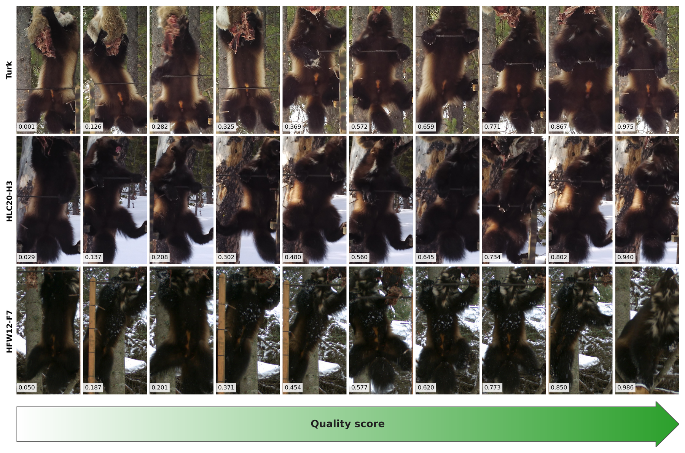

# Wolverine re-identification from camera trap imagery

Code, data pipeline, and results for a manuscript under review at *Ecological
Informatics*: automated re-identification and novelty detection of wolverines
(*Gulo gulo*) from bait-station camera trap images.

## The experiment

Wolverines are listed as threatened under the U.S. Endangered Species Act and
occur at low density in remote terrain, so camera trap re-identification is
one of few practical ways to study them. A bait frame exposes the ventral
pelage pattern to a nearby game camera, but the animal moves while it feeds and the pattern is clearly visible in only a fraction of frames. The pipeline has two stages.

1. **Pelage visibility classifier.** An image classifier scores every image from 0 to 1, the estimated
   probability that the pelage pattern is clearly visible. We call this the
   quality score.
2. **Re-identification with novelty detection.** An image encoder maps each image to an embedding, and images are compared by the similarity of their embeddings.
   A query is assigned to the known individual of its nearest gallery image,
   or flagged as unknown when that similarity falls below a threshold. We compared three encoders: DINOv3-ViT-B/16
   (general-purpose; [Siméoni et al. 2025](https://doi.org/10.48550/arXiv.2508.10104)),
   BioCLIP-2 ViT-L/14 (biology-specific; [Gu et al. 2025](https://doi.org/10.48550/arXiv.2505.23883)),
   and MegaDescriptor-L-384 (wildlife-specific; [Čermák et al. 2023](https://doi.org/10.48550/arXiv.2311.09118)).

Quality score thresholds of 0, 0.25, and 0.50 are applied to the gallery, to
the queries, or to both. Re-identification is scored by recall at rank one and
novelty detection by balanced accuracy, each averaged over individuals. Two
experiments: a few-shot analysis (2 to 64 gallery images per individual, eight
seeds) and a full-data comparison on a temporal test holdout.



*The quality score as a gradient within a single capture event. Each row is
one daytime event of one individual, ten images sorted from low to high
score, with the score printed on each image. Camera, scene, and lighting are
fixed within a row, so the score changes with the animal's pose alone.*

## Environment

```bash
mamba env create -f environment.yml
mamba activate wolverines
```

`environment.yml` pins PyTorch 2.7.1 and installs transformers from source
(required for DINOv3). The MegaDetector cropping step runs in its own
environment; see `install_minimal_pytorchwildlife.sh`. Gated model downloads
read `HF_TOKEN` from a `.env` file at the repository root.

The experiments were run on a Slurm cluster with a preemptible GPU partition.
Every `.sbatch` file changes to the repository root and uses relative paths,
and training scripts checkpoint and resume on preemption.

## Data

The dataset is hosted on Hugging Face as `kdoherty/wolverines` with two
configurations: `pelage` (human-labeled crops for stage 1) and
`reidentification` (all scored crops with individual identity, for stage 2).
Splits are temporal within each individual, so no test image predates a
training image of the same animal. The dataset carries no coordinates or
location metadata.

```python
from datasets import load_dataset
ds = load_dataset("kdoherty/wolverines", "reidentification", split="train")
```

How the dataset was built from raw camera trap images is documented in
[hugging_face_dataset/v2/README.md](hugging_face_dataset/v2/README.md).

## Layout

| Directory | Contents |
|---|---|
| `hugging_face_dataset/v2/` | Dataset creation: field pre-screening, MegaDetector cropping, labeling app, pelage inference, dataset export |
| `pelage_sorting/` | Stage 1, the pelage visibility classifier |
| `preprocessing/` | Assignment of individuals to gallery, validation, and unknown roles; manuscript table and figure generators |
| `reid_openset/` | Stage 2, re-identification and novelty detection for the three encoders, with results and summaries |
| `utils/` | Shared code: dataset loading, models, training, ArcFace, evaluation, plotting |

## Runbooks

Each stage has a README that lists its scripts in run order, their inputs and
outputs, and the values used for the manuscript.

1. [Dataset creation](hugging_face_dataset/v2/README.md)
2. [Pelage visibility classifier](pelage_sorting/README.md)
3. [Role assignment and manuscript assets](preprocessing/README.md)
4. [Re-identification and novelty detection](reid_openset/README.md)

Experiment notes, including negative results, are in
`pelage_sorting/RESEARCH_LOG.md`.

## Citation

To be added on publication.

## References

- Čermák, V., Picek, L., Adam, L., and Papafitsoros, K. 2023. WildlifeDatasets: an
  open-source toolkit for animal re-identification. arXiv:2311.09118.
  https://doi.org/10.48550/arXiv.2311.09118
- Gu, J., Stevens, S., Campolongo, E. G., Thompson, M. J., Zhang, N., Wu, J.,
  Kopanev, A., Mai, Z., White, A. E., Balhoff, J., Dahdul, W., Rubenstein, D.,
  Lapp, H., Berger-Wolf, T., Chao, W.-L., and Su, Y. 2025. BioCLIP 2: emergent
  properties from scaling hierarchical contrastive learning. arXiv:2505.23883.
  https://doi.org/10.48550/arXiv.2505.23883
- Hernandez, A., Miao, Z., Vargas, L., Beery, S., Dodhia, R., Arbelaez, P., and
  Lavista Ferres, J. M. 2024. Pytorch-Wildlife: a collaborative deep learning
  framework for conservation. arXiv:2405.12930.
  https://doi.org/10.48550/arXiv.2405.12930
- Siméoni, O., Vo, H. V., Seitzer, M., Baldassarre, F., Oquab, M., Jose, C.,
  Khalidov, V., Szafraniec, M., Yi, S., Ramamonjisoa, M., Massa, F., Haziza, D.,
  Wehrstedt, L., Wang, J., Darcet, T., Moutakanni, T., Sentana, L., Roberts, C.,
  Vedaldi, A., Tolan, J., Brandt, J., Couprie, C., Mairal, J., Jégou, H.,
  Labatut, P., and Bojanowski, P. 2025. DINOv3. arXiv:2508.10104.
  https://doi.org/10.48550/arXiv.2508.10104
